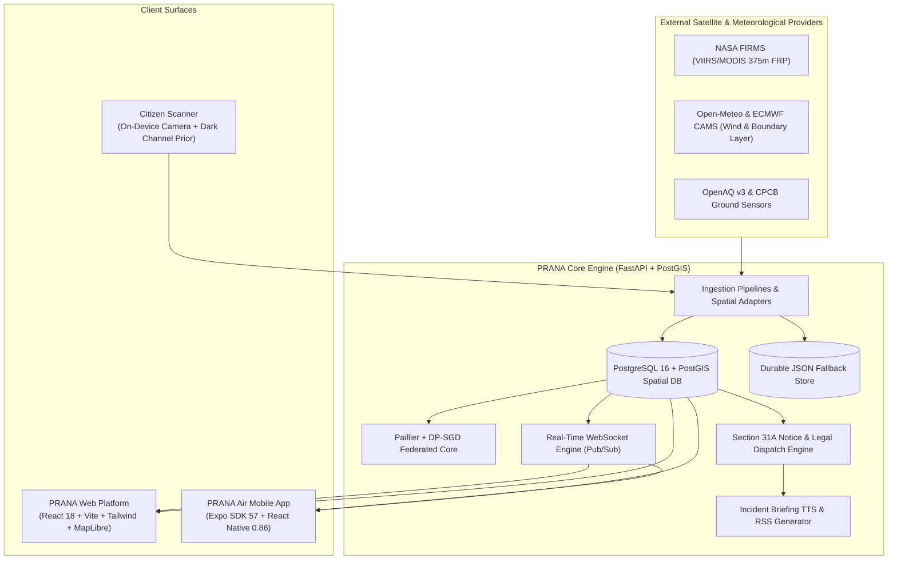

<div align="center">

# ✦ PRANA Air (प्राण) ✦
### *Atmospheric Intelligence & Transboundary Airshed Orchestration Platform*

[](https://fastapi.tiangolo.com)
[](https://react.dev)
[](https://expo.dev)
[](https://postgis.net)
[](https://www.python.org)
[](https://www.typescriptlang.org)

<p align="center">
  <b>A full-stack, transboundary environmental intelligence system uniting satellite remote sensing, boundary-layer meteorology, privacy-preserving federated AI, regulatory legal war rooms, and edge citizen sensing across the Indo-Gangetic Airshed.</b>
</p>

</div>

---

## 📑 Table of Contents

- [Executive Overview](#-executive-overview)
- [System Architecture](#-system-architecture)
- [Core Functional Modules](#-core-functional-modules)
  - [1. Air Corridor Trajectory & Ingress Tracker](#1-air-corridor-trajectory--ingress-tracker)
  - [2. 72-Hour Atmospheric Inversion & Plume Forecast](#2-72-hour-atmospheric-inversion--plume-forecast)
  - [3. Cross-Border Federated Learning Mesh](#3-cross-border-federated-learning-mesh)
  - [4. Regulatory Enforcement & Legal War Room](#4-regulatory-enforcement--legal-war-room)
  - [5. Citizen Sky Haze Estimator (Edge DCP Inference)](#5-citizen-sky-haze-estimator-edge-dcp-inference)
  - [6. Real-Time Audio Briefings & Multi-Channel Broadcasts](#6-real-time-audio-briefings--multi-channel-broadcasts)
- [Repository Structure](#-repository-structure)
- [Quick Start Guide](#-quick-start-guide)
  - [Option A: Full-Stack with Docker Compose (Recommended)](#option-a-full-stack-with-docker-compose-recommended)
  - [Option B: Local Component Setup](#option-b-local-component-setup)
    - [1. Backend (FastAPI + PostGIS)](#1-backend-fastapi--postgis)
    - [2. Web Frontend (React + Vite)](#2-web-frontend-react--vite)
    - [3. Mobile App (Expo SDK 57)](#3-mobile-app-expo-sdk-57)
- [Data Feeds & Standards Compliance](#-data-feeds--standards-compliance)
- [Testing & Quality Verification](#-testing--quality-verification)
- [Environment Configuration Reference](#-environment-configuration-reference)
- [License & Ethical AI Notice](#-license--ethical-ai-notice)

---

## 🌍 Executive Overview

Every winter, the Indo-Gangetic Plains (IGP)—spanning Punjab, Haryana, and the National Capital Region (Delhi NCR)—suffer from catastrophic hazardous air pollution (AQI > 450). This crisis is driven by the confluence of:
1. **Upwind Agricultural Emissions**: Widespread post-monsoon paddy crop residue (stubble) burning.
2. **Boundary-Layer Meteorological Inversions**: Sinking nocturnal temperatures trapping pollutants below shallow mixing layer heights (< 200m).
3. **Northwesterly Surface Winds**: Channeling smoke along the NH-44 Grand Trunk road corridor directly into the Delhi topological basin.
4. **Jurisdictional Silos**: Fragmented regulatory enforcement between different State Pollution Control Boards (SPCBs).

**PRANA (प्राण)** addresses this transboundary environmental challenge by providing a unified, scientifically grounded platform. It fuses real-time satellite telemetry, atmospheric transport modeling, homomorphic federated learning, and legal compliance automation into an actionable system for citizens, scientists, and enforcement authorities.

---

## 🏛 System Architecture

PRANA is built as an integrated, multi-tier ecosystem:



---

## ⚡ Core Functional Modules

### 1. Air Corridor Trajectory & Ingress Tracker
* **Tri-Node Atmospheric Vector Pipeline**: Continuously models transboundary transport across three critical segments:
  - **Node 01 (Upwind Origin)**: Punjab Malwa Agricultural Belt (Sangrur, Patiala clusters).
  - **Node 02 (Transit Channel)**: Haryana NH-44 Highway Belt (Karnal, Panipat transport channel).
  - **Node 03 (Receptor Sink)**: Delhi NCR Topographical Basin (Anand Vihar, Yamuna floodplains).
* **Dynamic Streamlines & Spatial Layers**: Visualizes wind vector streamlines, Fire Radiative Power (FRP) heatmaps, Gaussian Process Regression (GPR) PM2.5 grids, and OGC SensorThings stations.
* **Lag Analytics**: Automatically tracks temporal lag correlations (typically 24h–48h) between upwind stubble fires and downwind receptor AQI spikes.

### 2. 72-Hour Atmospheric Inversion & Plume Forecast
* **Interactive Horizon Scrubber**: Scrub forward across T+0h, T+24h, T+48h, and T+72h forecast envelopes.
* **Meteorological Sounding**: Computes boundary-layer mixing height ($H_{\text{pbl}}$) and ventilation coefficients ($V_i = U \cdot H_{\text{pbl}}$) to detect nocturnal stagnation locks ($V_i < 2{,}200\text{ m}^2/\text{s}$).
* **Ward Vulnerability Matrix**: Identifies municipal wards at immediate risk of particulate trapping.

### 3. Cross-Border Federated Learning Mesh
* **Privacy-Preserving Collaboration**: Allows Punjab, Haryana, and Delhi state authorities to train joint air quality prediction models without centralizing raw sensor data.
* **Cryptographic Security & Differential Privacy**:
  - **Paillier Homomorphic Encryption**: 2048-bit keypair for cryptographically sealed weight aggregation.
  - **DP-SGD**: Record-level clipped gradients with calibrated Gaussian noise ($\epsilon = 0.42, \delta = 10^{-5}$) under a conservative Zero-Concentrated Differential Privacy (zCDP) accountant.
* **Interactive Convergence Visualizer**: Real-time multi-line charts showing global accuracy and Mean Squared Error (MSE) loss across decoupled silos.

### 4. Regulatory Enforcement & Legal War Room
* **Section 31A Air Act Pipeline**: Automates statutory notice generation under Section 31A of the *Air (Prevention and Control of Pollution) Act, 1981*.
* **Pramaan Evidence Sealing**: Generates cryptographically hashed electronic evidence packages compliant with Section 65B of the *Indian Evidence Act* / *Bharatiya Sakshya Adhiniyam*.
* **Flying Squad Rapid Dispatch**: One-tap escalation to dispatch inter-state enforcement squads to high-FRP clusters.
* **Continuous Emission Monitoring (CEMS)**: Deterministic heuristic scrutiny of industrial stack telemetry and scrubber status.

### 5. Citizen Sky Haze Estimator (Edge DCP Inference)
* **Mobile Camera & Gallery Ingestion**: Citizens capture outdoor sky imagery along with device GPS coordinates.
* **Dark Channel Prior (DCP)**: Decomposes optical atmospheric depth and haze transmission ratios to estimate particulate matter ($\mu\text{g/m}^3$) and AQI sub-indices in real time.
* **Actionable Citizen Health Checklist**: Context-aware protective guidance (N95 mask reminders, indoor HEPA purifier automation, morning exercise deferrals).

### 6. Real-Time Audio Briefings & Multi-Channel Broadcasts
* **Docked Floating Audio Player**: Native lock-screen and background audio playback for daily regional atmospheric briefings.
* **Dynamic RSS & TTS**: Real-time synthetic speech rendering of official regulatory bulletins in English, Hindi (हिन्दी), and Punjabi (ਪੰਜਾਬੀ).
* **Emergency Push Alerts**: Sub-second WebSocket broadcasts and native notifications for critical hazardous pollution events.

---

## 📁 Repository Structure

```text
Prana.ai/
├── backend/                       # FastAPI High-Performance Backend
│   ├── data/                      # Sample datasets, historical benchmarks, and calibration profiles
│   ├── ingesters/                 # NASA FIRMS, Open-Meteo, OpenAQ, and CAMS connectors
│   ├── ml/                        # Federated learning (Paillier + DP-SGD) and DCP haze models
│   ├── routers/                   # REST endpoints (alerts, analytics, cems, forecast, legal, ws)
│   ├── scripts/                   # Local launchers, preflight checkers, and load tests
│   ├── tests/                     # Unit and integration pytest test suites
│   ├── database.py                # PostGIS migrations and durable fallback JSON storage
│   ├── main.py                    # Application factory, CORS, and lifecycle management
│   ├── models.py                  # Pydantic schemas and spatial GeoJSON models
│   ├── scheduler.py               # Periodic ingestion scheduler (15-min refresh, 60-sec push)
│   └── tts.py                     # Text-To-Speech incident briefing generation
│
├── mobile-app/                    # PRANA Air Native Mobile Application (iOS & Android)
│   ├── assets/                    # Application icons, splash screens, and audio chimes
│   ├── src/
│   │   ├── api/                   # REST client, WebSocket client, and offline caching layer
│   │   ├── components/            # Neo-brutalist tactile components (NeoCard, NeoButton, DualUnitChip, etc.)
│   │   ├── hooks/                 # Real-time WebSocket subscriptions and telemetry hooks
│   │   ├── screens/               # 6 core application screens matching atmospheric design playbook
│   │   ├── services/              # Push notifications, background audio, and offline preferences
│   │   └── theme/                 # Master color tokens, spacing scales, and typography
│   ├── App.tsx                    # Shell container, safe area manager, and floating player
│   └── app.json                   # Expo SDK 57 manifest configuration
│
├── web/                           # PRANA Web Desktop Portal
│   ├── src/
│   │   ├── api/                   # Web HTTP/WS client adapters
│   │   ├── components/            # Dashboard widgets, navigation headers, and charts
│   │   └── pages/                 # Full-screen pages for corridor, forecast, mesh, and war room
│   ├── index.html                 # Entrypoint HTML with typography
│   └── vite.config.ts             # Vite bundler configuration
│
├── frontend-essentials/           # Design System & Documentation
│   ├── PRANA_Atmospheric_Intelligence_Playbook_v1.md
│   ├── main-design/               # Desktop design specifications
│   └── mobile-design/             # Neo-brutalist mobile specifications and token definitions
│
├── docker-compose.yml             # Containerized orchestration (PostGIS + FastAPI)
└── README.md                      # This master platform documentation
```

---

## 🚀 Quick Start Guide

### Option A: Full-Stack with Docker Compose (Recommended)

Run the entire backend with a persistent PostGIS database in a single command:

```bash
# 1. Clone the repository
git clone https://github.com/calmcode47/Prana.ai.git
cd Prana.ai

# 2. Configure environment secrets
cp backend/.env.example backend/.env

# 3. Launch database and API containers
docker compose up --build
```

- **API Documentation (Swagger)**: http://localhost:8000/docs
- **Health Check**: http://localhost:8000/health
- **Database Readiness**: http://localhost:8000/ready

---

### Option B: Local Component Setup

#### 1. Backend (FastAPI + PostGIS)
**Prerequisites**: Python `>= 3.12` (Python 3.14 recommended).

```bash
cd backend

# Create virtual environment & install locked dependencies
python -m venv .venv
source .venv/bin/activate  # On Windows: .venv\Scripts\activate
pip install -r requirements.lock.txt

# Configure environment
cp .env.example .env

# Start local server (defaults to port 8000 on 0.0.0.0)
python -m backend.scripts.serve
```
*Note: If no `DATABASE_URL` is configured, PRANA automatically activates its durable development JSON store at `.local/prana-store.json`.*

#### 2. Web Frontend (React + Vite)
**Prerequisites**: Node.js `>= 20`.

```bash
cd web
npm install
npm run dev
```
Open http://localhost:5173 to access the web portal.

#### 3. Mobile App (Expo SDK 57)
**Prerequisites**: Node.js `>= 20.19.4`, Expo Go app on iOS or Android (Version `57.0.9`).

```bash
cd mobile-app
npm install

# Option 1: Standard LAN mode (phone on same Wi-Fi)
npx expo start

# Option 2: Tunnel mode (remote phones via ngrok bridge)
npm run start:tunnel
```
Scan the displayed QR code with the **Expo Go app** on Android or the **default Camera app** on iOS.

---

## 📊 Data Feeds & Standards Compliance

| Domain | Source Provider | Frequency | Standards & Units |
| :--- | :--- | :--- | :--- |
| **Active Stubble Fires** | NASA FIRMS (VIIRS 375m / MODIS 1km) | 15 minutes | Megawatts (MW) Fire Radiative Power (FRP) |
| **Wind & Boundary Layer** | Open-Meteo & ECMWF CAMS | Hourly / 6-hourly | Wind vector ($u, v$ m/s), Boundary height ($H_{\text{pbl}}$ m AGL) |
| **Continuous Emissions** | Industrial CEMS Feeds | Real-time batch | Scrubber differential pressure, flow velocity (m/s) |
| **Surface Air Quality** | OGC SensorThings & OpenAQ v3 | 15 minutes | $\mu\text{g/m}^3$ PM2.5 mass concentration |
| **AQI Regulatory Sub-Index** | Central Pollution Control Board (CPCB) | Instantaneous | India National Air Quality Index (0–500 scale) |
| **Legal Proof of Evidence** | Pramaan Engine | On-demand | Section 65B Electronic Record Compliance (SHA-256) |

---

## 🧪 Testing & Quality Verification

PRANA maintains automated test coverage across all layers:

### Mobile App Unit & Integration Tests (Jest)
```bash
cd mobile-app
npm test
```
*Validates 5 test suites (42 tests) covering CPCB AQI calculations, citizen photo uploads, UI component layout, screen mounting, and corridor flow.*

### Backend Tests (Pytest)
```bash
cd backend
python -m pytest tests -q -m "not integration"
```
*Validates API route responses, rate limiters, DP-SGD privacy accountants, Paillier aggregation, and database migrations.*

### Web Tests (Vitest)
```bash
cd web
npm test
```
*Validates React page rendering, navigation flows, and telemetry calculations.*

---

## ⚙️ Environment Configuration Reference

The backend recognizes the following variables in `.env`:

| Variable | Description | Default | Required? |
| :--- | :--- | :--- | :--- |
| `DATABASE_URL` | PostgreSQL/PostGIS connection string | *Local file fallback* | In production |
| `FIRMS_MAP_KEY` | NASA FIRMS API key for live thermal satellite feeds | `""` | Optional |
| `OPENAQ_API_KEY` | OpenAQ v3 API credential | `""` | Optional |
| `CEMS_INGEST_API_KEY`| Shared secret for industrial facility emission feeds | `""` | Required in prod |
| `TTS_PROVIDER_KEY` | OpenAI-compatible API key for audio briefings | `""` | Optional |
| `PRANA_DEMO_MODE` | Allow labeled historical sample data when providers fail | `false` | Development |
| `PRANA_ENV` | Environment identifier (`development` / `production`) | `development`| Recommended |
| `CORS_ORIGINS` | Comma-separated allowed client origins | `*` | In production |
| `PRANA_FL_DP_ENABLED`| Enable differential privacy in federated rounds | `true` | No |
| `PRANA_FL_PAILLIER_ENABLED`| Enable 2048-bit Paillier homomorphic encryption | `true` | No |

---

## 📜 License & Ethical AI Notice

- **Scientific Disclaimer**: Atmospheric plume dispersions and edge camera inferences are diagnostic model approximations and do not substitute for official regulatory reference-grade monitors (Beta Attenuation Monitors / TEOM).
- **Privacy Assurance**: Citizen uploads are processed in memory, stripped of EXIF metadata, hashed for deduplication, and discarded immediately after inference. Raw photographs are never stored or sold.
- **License**: Released under the MIT Open Source License. Built for public good and environmental health protection across the Indo-Gangetic Airshed.
